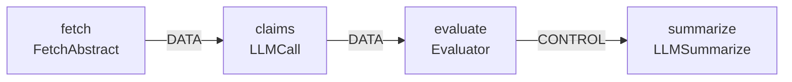

# Idiograph

[](https://github.com/idiograph/idiograph/actions/workflows/tests.yml) [](https://codecov.io/github/idiograph/idiograph)

**A semantic graph system for VFX and AI workflows — built to demonstrate what production AI tooling looks like when it is designed by a pipeline engineer.**

---

## The Idea

VFX pipelines have had a workable answer to the AI state management problem for decades: represent the work as a directed graph of typed, parameterized nodes with defined data and control flows. The graph is the source of truth. Every operator — human, tool, or agent — reads from and writes to that structure. The system is inspectable, serializable, and auditable by design.

Idiograph applies that architecture to AI agent workflows. The question it asks is practical rather than polemical: what does AI tooling look like when you build it this way?

---

## What This Is

Idiograph is a Python-based semantic graph system. Pipeline stages and agent operations are represented as nodes in a unified, typed, JSON-serializable graph. The graph is the single source of truth. CLI, agents, and UI are all operators on that graph — none of them own state.

The current implementation includes a working arXiv research pipeline: nodes that fetch a paper, extract claims via LLM, evaluate against keyword criteria, and conditionally summarize. The LLM participates as a bounded node — it receives a defined input, returns a structured output, and the graph moves on. It does not orchestrate.

Phase 9 extends this to a citation graph: multi-seed backward and forward traversal, citation acceleration ranking, and semantic relationship annotation via LLM. Phase 10 applies the same architecture to USD composition inversion — a deterministic backward-chaining solver for VFX asset pipeline decisions. There is no special-casing in the executor across any of these domains.

An MCP server wraps the core graph operations as six standards-compliant tools (`get_node`, `get_edges_from`, `update_node`, `summarize_intent`, `validate_graph`, `execute_graph`). Any MCP-compatible agent client can connect, inspect the graph, mutate node parameters, and trigger execution without bespoke adapter code.

---

## Current Status

| Phase | Description | Status |
| --- | --- | --- |
| 0 | Environment & tooling | ✅ Complete |
| 1 | Structured JSON output | ✅ Complete |
| 2 | Package structure & reusability | ✅ Complete |
| 3 | Pydantic data models & validation | ✅ Complete |
| 4.5 | Graph query & analysis | ✅ Complete |
| 5 | Testing, logging, config | ✅ Complete |
| 6 | Async execution engine | ✅ Complete |
| 7 | Architecture refinement | ✅ Complete |
| 8 | Agent integration (MCP) | ✅ Complete |
| 9 | arXiv citation graph demo | 🔄 In progress — pipeline nodes, D3 renderer |
| 10 | USD composition inversion | Planned |

---

## Architecture

```
src/idiograph/
├── core/
│   ├── models.py          # Node, Edge, Graph — Pydantic models with agent-readable field descriptions
│   ├── graph.py           # Core graph operations
│   ├── query.py           # Traversal, cycle detection, integrity validation, intent summary
│   ├── executor.py        # Async execution engine — topological order, failure containment
│   ├── config.py          # TOML config loader
│   └── logging_config.py
├── domains/
│   ├── arxiv/             # arXiv pipeline — handlers, pipeline graph, mock stubs
│   │   ├── pipeline.py
│   │   ├── handlers.py
│   │   └── mock_handlers.py
│   └── color_designer/    # Color Designer domain — handlers and pipeline graph
│       ├── __init__.py    # register_color_designer_handlers()
│       ├── handlers.py
│       └── pipeline.py
├── mcp_server.py          # MCP interface — six tools via stdio transport
└── main.py                # CLI entry point (Typer)

apps/color_designer/       # PySide6 UI — a view of the domain, not the domain itself
├── nodes/                 # Qt node classes, each implementing to_idiograph_node()
├── canvas.py              # build_graph() — assembles Graph from canvas state
└── main.py                # Save button → execute_graph()
```

### Core design decisions

**The graph never executes code directly.** It describes execution. The execution engine interprets it. This separation is what makes the graph inspectable, serializable, and agent-safe.

**Edge types are open strings, not a closed enum.** `DATA` and `CONTROL` are the standard types. Phase 10 introduces causal semantics (`MODULATES`, `DRIVES`, `OCCLUDES`, `EMITS`, `PROJECTS_TO`). The schema was designed for this from Phase 3.

**Node domain is metadata, never a structural constraint.** VFX and AI nodes are typed with labels — they are not structurally different kinds of objects. The same executor handles both.

**Handlers are registered, not imported.** The execution engine looks up handlers by node type string. It never imports handler modules directly. New node types require no changes to the executor.

**Domain implementations are isolated from core.** `core/` is domain-agnostic. The arXiv pipeline lives under `domains/arxiv/`. A VFX rendering domain in Phase 10 gets its own subdirectory. Nothing in `core/` changes when a new domain is added.

**`summarize_intent()` is purely algorithmic.** The query layer can describe what a subgraph does and where it might fail without an LLM call. Deterministic output for deterministic input.

---

## Pipelines



---

## Color Designer

A node graph tool for designing interface color palettes — a second expression of the same thesis in a different domain.

Color design is a pipeline: raw color values flow through semantic assignment nodes to produce a typed token file that drives a UI. The Color Designer makes that pipeline explicit, inspectable, and auditable. Same graph architecture as Idiograph's core. Same node-and-edge model. Same principle: the graph is the source of truth, the output file is a consequence of it.

The tool is implemented as a PySide6 desktop application. Current nodes: Color Swatch, Color Array, Schema (token role registry), Assign, Write. A wire system with typed ports and connection validation is in progress.

The Color Designer is not a companion tool. It is the domain-agnostic claim made concrete: the same architectural principles operating in UI design without modification. A technical evaluator who asks "but does this actually generalize?" is looking at the answer.

The domain implementation lives in `src/idiograph/domains/color_designer/`. The Qt application is in `apps/color_designer/` — a view of the domain, not the domain itself. and is designed to be extractable as a standalone application after the Idiograph demo is complete.

---

## What You Can Do With It Right Now

```bash
# Install
git clone https://github.com/idiograph/idiograph.git
cd idiograph
uv sync
uv pip install -e .

# Run the arXiv pipeline (requires ANTHROPIC_API_KEY in .env)
uv run idiograph run 1706.03762

# Run without an API key — mock handlers execute the full pipeline
uv run idiograph run 1706.03762 --mock

# Start the MCP server (stdio transport — connect any MCP-compatible client)
uv run idiograph serve

# Explore and inspect the graph
uv run idiograph stats                         # Pipeline statistics as JSON
uv run idiograph workflows                     # Full graph manifest
uv run idiograph validate path/to/graph.json   # Validate any graph file
uv run idiograph check                         # Integrity + cycle detection
uv run idiograph query downstream node_03      # Downstream traversal
uv run idiograph query upstream node_05        # Upstream traversal
uv run idiograph query topo                    # Topological execution order
uv run idiograph query intent                  # Semantic intent summary

# Test
uv run pytest tests/ -v
```

---

## The Thesis Connection

The goal of this system is to make a concrete architectural argument.

A graph that can be serialized to JSON and reconstructed without loss is a graph an agent can safely read and write. A query layer that can answer "what does this subgraph do and where might it fail?" without an LLM call is a system that does not depend on probabilistic inference to reason about its own state. An execution engine that records failure in graph state rather than raising an exception is a system that remains inspectable after something goes wrong.

These are architectural properties, not features — and they are what make AI tooling legible to the production environments it is supposed to serve.

---

## Stack

**Core**

* Python 3.13
* [Pydantic](https://docs.pydantic.dev/) — typed models and validation
* [Typer](https://typer.tiangolo.com/) — CLI interface
* [NetworkX](https://networkx.org/) — graph traversal and analysis
* [uv](https://github.com/astral-sh/uv) — dependency and environment management
* [ruff](https://docs.astral.sh/ruff/) — lint and format

**Pipeline**

* [httpx](https://www.python-httpx.org/) — async HTTP client
* [anthropic](https://github.com/anthropic/anthropic-sdk-python) — LLM API
* [python-dotenv](https://github.com/theskumar/python-dotenv) — environment config

**Agent interface**

* [mcp](https://github.com/modelcontextprotocol/python-sdk) — stdio transport, six tools

**Color Designer**

* [PySide6](https://doc.qt.io/qtforpython/) — node graph UI

**Testing**

* [pytest](https://pytest.org/) + [pytest-cov](https://pytest-cov.readthedocs.io/)

---

## Documentation

Phase summaries and architectural decision logs are in [`docs/`](https://github.com/idiograph/idiograph/blob/main/docs).

* [Blueprint](https://github.com/idiograph/idiograph/blob/main/docs/vision/vision-blueprint-original.md) — full curriculum and system design
* [Amendments](https://github.com/idiograph/idiograph/blob/main/docs/decisions/amendments.md) — architectural decisions and constraint log
* [Session Workflow](https://github.com/idiograph/idiograph/blob/main/docs/workflow.md) — how development sessions are structured
* Phase summaries: [Phase 0](https://github.com/idiograph/idiograph/blob/main/docs/phases/phase-00-foundation.md) · [Phase 1](https://github.com/idiograph/idiograph/blob/main/docs/phases/phase-01-rapid-fluency-semantic-output.md) · [Phase 2](https://github.com/idiograph/idiograph/blob/main/docs/phases/phase-02-project-structure-reusability.md) · [Phase 3](https://github.com/idiograph/idiograph/blob/main/docs/phases/phase-03-data-models-typing.md) · [Phase 4.5](https://github.com/idiograph/idiograph/blob/main/docs/phases/phase-04-05-graph-query-analysis.md) · [Phase 5](https://github.com/idiograph/idiograph/blob/main/docs/phases/phase-05-testing-logging-config.md) · [Phase 6](https://github.com/idiograph/idiograph/blob/main/docs/phases/phase-06-async-execution-orchestration.md) · [Phase 7](https://github.com/idiograph/idiograph/blob/main/docs/phases/phase-07-architecture-refinement.md) · [Phase 8](https://github.com/idiograph/idiograph/blob/main/docs/phases/phase-08-mcp-integration.md)
* Specs: [arXiv pipeline](https://github.com/idiograph/idiograph/blob/main/docs/specs/spec-arxiv-pipeline-final.md) · [Color Designer](https://github.com/idiograph/idiograph/blob/main/docs/specs/spec-color-designer.md) · [Phase 8–9 task inventory](https://github.com/idiograph/idiograph/blob/main/docs/specs/spec-phase-08-09-task-inventory.md)
