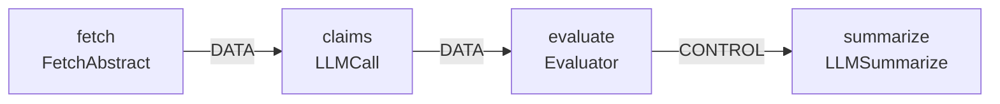

# Idiograph
[](https://github.com/idiograph/idiograph/actions/workflows/tests.yml)

**A semantic graph system for VFX and AI workflows — and a proof of concept for a thesis about how production AI tooling should actually work.**

---

## The Argument

Current AI tools fail in VFX production environments because they lack semantic context, deterministic behavior, and explicit state management. Probabilistic models are fundamentally in tension with the requirements of production pipelines, which demand reproducibility, auditability, and reliable communication of intent across technical and artistic teams.

The fix is not better prompts or bigger models. It is explicit structure.

VFX pipelines solved this problem decades ago: represent the work as a directed graph of typed, parameterized nodes with defined data and control flows. The graph is the source of truth. Every operator — human, tool, or agent — reads from and writes to that structure. The system is inspectable, serializable, and deterministic by design.

Idiograph applies that same architecture to AI agent workflows, and asks: what does AI tooling look like when it is built the way a production pipeline engineer would build it?

---

## What This Is

Idiograph is a Python-based semantic graph system. It represents VFX pipeline stages and AI agent operations as nodes in a unified, typed, JSON-serializable graph. The graph is the single source of truth. CLI, agents, and (optionally) UI are all operators on that graph — none of them own state.

The current implementation includes an arXiv research pipeline — nodes that fetch a paper, extract claims via LLM, evaluate against keyword criteria, and conditionally summarize. The architecture is domain-agnostic by design: VFX pipeline nodes (LoadAsset, ApplyShader, ShaderValidate) and additional AI agent node types are planned for Phase 10. Both would be represented identically to the existing nodes. There is no special-casing in the executor.

---

## Current Status

| Phase | Description | Status |
|---|---|---|
| 0 | Environment & tooling | ✅ Complete |
| 1 | Structured JSON output | ✅ Complete |
| 2 | Package structure & reusability | ✅ Complete |
| 3 | Pydantic data models & validation | ✅ Complete |
| 4.5 | Graph query & analysis | ✅ Complete |
| 5 | Testing, logging, config | ✅ Complete |
| 6 | Async execution engine | ✅ Complete |
| 7 | Architecture refinement | ✅ Complete |
| 8 | Agent integration (MCP) | 🔄 In progress |
| 9 | Documentation & visibility | Planned |
| 10 | Projection-aware rendering domain | Planned |

---

## Architecture
```
src/idiograph/
├── core/
│   ├── models.py          # Node, Edge, Graph — Pydantic models with agent-readable field descriptions
│   ├── graph.py           # Core graph operations
│   ├── query.py           # Traversal, cycle detection, integrity validation, intent summary
│   ├── config.py          # TOML config loader
│   └── logging_config.py
├── domains/
│   └── arxiv/             # Domain implementation — one of many possible domains
│       ├── __init__.py
│       ├── pipeline.py
│       └── handlers.py
└── main.py                # CLI entry point (Typer)
```

### Core design decisions

**The graph never executes code directly.** It describes execution. The execution engine interprets it. This separation is what makes the graph inspectable, serializable, and agent-safe.

**Edge types are open strings, not a closed enum.** `DATA` and `CONTROL` are the standard types. Phase 10 introduces causal semantics (`MODULATES`, `DRIVES`, `OCCLUDES`, `EMITS`, `PROJECTS_TO`). The schema was designed for this from Phase 3.

**Node domain is metadata, never a structural constraint.** VFX and AI nodes are typed with labels — they are not structurally different kinds of objects. The same executor handles both.

**Handlers are registered, not imported.** The execution engine looks up handlers by node type string. It never imports handler modules directly. New node types require no changes to the executor.

**Domain implementations are isolated from core.** `core/` is domain-agnostic. The arXiv pipeline lives under `domains/arxiv/`. A VFX rendering domain in Phase 10 gets its own subdirectory. Nothing in `core/` changes when a new domain is added.

**`summarize_intent()` is purely algorithmic.** The query layer can describe what a subgraph does and where it might fail without an LLM call. Deterministic output for deterministic input.

---

## Pipelines

<!-- GENERATED:arxiv-pipeline -->

<!-- END GENERATED -->

---

## What You Can Do With It Right Now


```bash
# Install
git clone https://github.com/idiograph/idiograph.git
cd idiograph
uv sync
uv pip install -e .

# Explore the graph
uv run idiograph stats                         # Pipeline statistics as JSON
uv run idiograph workflows                     # Full graph manifest
uv run idiograph validate path/to/graph.json   # Validate any graph file
uv run idiograph check                         # Integrity + cycle detection
uv run idiograph query downstream node_03      # Downstream traversal
uv run idiograph query upstream node_05        # Upstream traversal
uv run idiograph query topo                    # Topological execution order
uv run idiograph query intent                  # Semantic intent summary


# Test
uv run pytest tests/ -v
```

---

## The Thesis Connection

The goal of this system is to make a concrete argument about AI tooling in production environments.

A graph that can be serialized to JSON and reconstructed without loss is a graph an agent can safely read and write. A query layer that can answer "what does this subgraph do and where might it fail?" without an LLM call is a system that does not depend on probabilistic inference to reason about its own state. An execution engine that records failure in graph state rather than raising an exception is a system that remains inspectable after something goes wrong.

These are architectural properties, not features. They are what production pipeline engineers have required for decades, and what current AI tooling largely does not provide.

Idiograph is a proof of concept for what it looks like when you build AI-operable systems the way a pipeline engineer would build them.

---

## Stack

- Python 3.13
- [Pydantic](https://docs.pydantic.dev/) — typed models and validation
- [Typer](https://typer.tiangolo.com/) — CLI interface
- [NetworkX](https://networkx.org/) — graph traversal and analysis
- [uv](https://github.com/astral-sh/uv) — dependency and environment management
- [pytest](https://pytest.org/) — test suite

---

## Documentation

Phase summaries and architectural decision logs are in [`docs/`](docs/).

- [Blueprint](docs/blueprint.md) — full curriculum and system design
- [Blueprint Amendments](docs/blueprint_amendments.md) — architectural decisions and constraint log
- [Session Workflow](docs/session_workflow.md) — how development sessions are structured
- Phase summaries: [Phase 0](docs/phase_0_summary.md) · [Phase 1](docs/phase_1_summary.md) · [Phase 2](docs/phase_2_summary.md) · [Phase 3](docs/phase_3_summary.md) · [Phase 4.5](docs/phase_4_5_summary.md) · [Phase 5](docs/phase_5_summary.md) · [Phase 6](docs/phase_6_summary.md) · [Phase 7](docs/phase_7_summary.md)