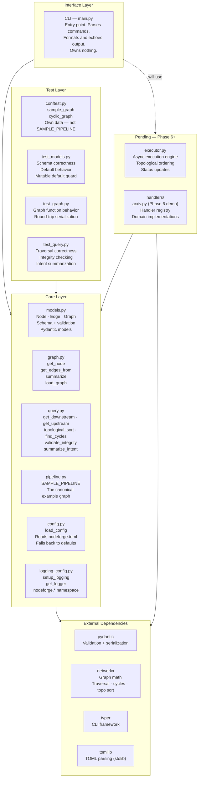
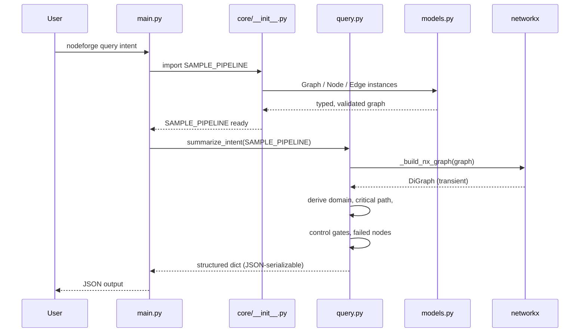

# NodeForge — Architecture Diagrams

---

## 1. Module Dependency Graph

Who imports what. Arrows point in the direction of dependency.

```mermaid
graph TD
    subgraph CLI
        main["main.py"]
    end

    subgraph core
        init["core/__init__.py"]
        models["core/models.py"]
        graph["core/graph.py"]
        query["core/query.py"]
        pipeline["core/pipeline.py"]
        config["core/config.py"]
        logging_config["core/logging_config.py"]
    end

    subgraph tests
        conftest["tests/conftest.py"]
        test_models["tests/test_models.py"]
        test_graph["tests/test_graph.py"]
        test_query["tests/test_query.py"]
    end

    subgraph external
        pydantic["pydantic"]
        networkx["networkx"]
        typer["typer"]
        tomllib["tomllib (stdlib)"]
        logging["logging (stdlib)"]
    end

    main --> init
    main --> query
    main --> pydantic

    init --> pipeline
    init --> graph
    init --> config
    init --> logging_config

    pipeline --> models
    graph --> models
    graph --> logging_config
    query --> models
    query --> logging_config
    query --> networkx

    config --> tomllib
    logging_config --> logging

    models --> pydantic
    main --> typer

    conftest --> models
    test_models --> models
    test_models --> pydantic
    test_graph --> graph
    test_query --> query
    test_query --> models
```

---

## 2. Architecture Layer Diagram

The system as zones of responsibility. Arrows show the direction of allowed dependency.



---

## 3. Data Flow — A Query Through the System

How a single CLI command moves through the layers.



---

## Key Rules the Diagrams Encode

| Rule | Where Visible |
|---|---|
| CLI never owns data or logic | Diagram 1 — main.py has no arrows going into it from core internals |
| Core never depends on CLI | Diagram 2 — dependency arrows only flow downward |
| networkx is transient | Diagram 3 — NX is used and gone within query.py, never surfaces to CLI |
| Tests own their data | Diagram 2 — conftest.py is isolated, no arrow to SAMPLE_PIPELINE |
| Handlers never touch executor internals | Diagram 2 — pending layer shows handlers and executor as siblings under core |
| External deps stay at the bottom | Diagram 2 — nothing in external imports from core |
